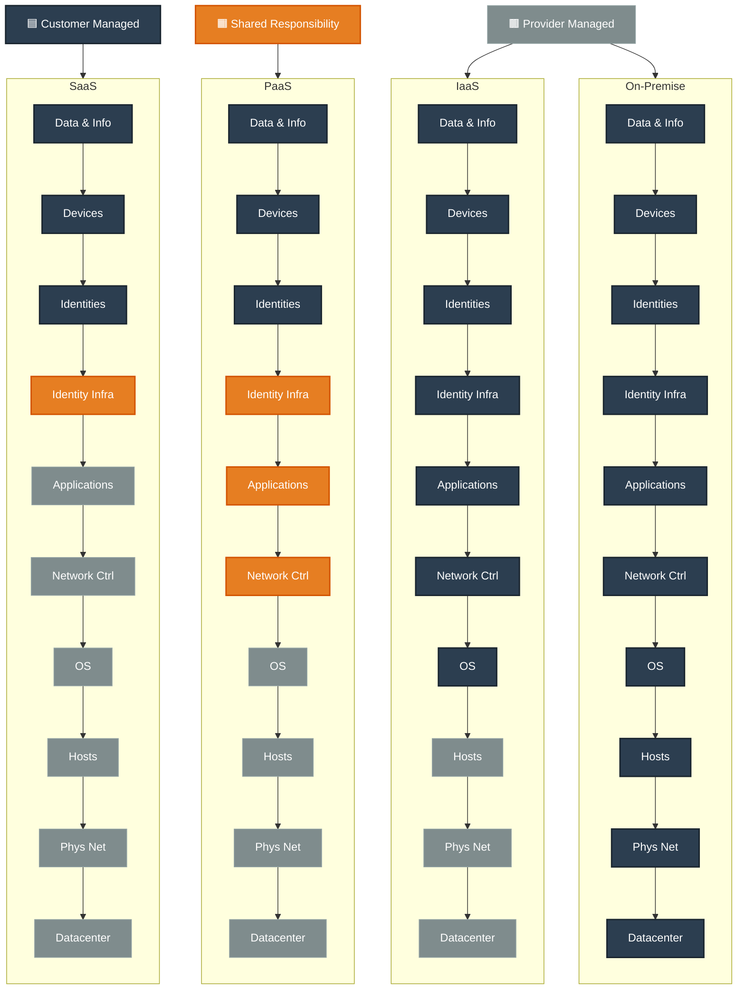

## Shared Resposibility model
The IT departent is responsible for maintaining the physical space, ensuring security, and maintaining or replacing the servers if anything happens. With the shared responsibility model, these responsibilities get shared between the cloud provider and the consumer. Physical security, power, cooling, and network connectivity are the responsibility of the cloud provider.

