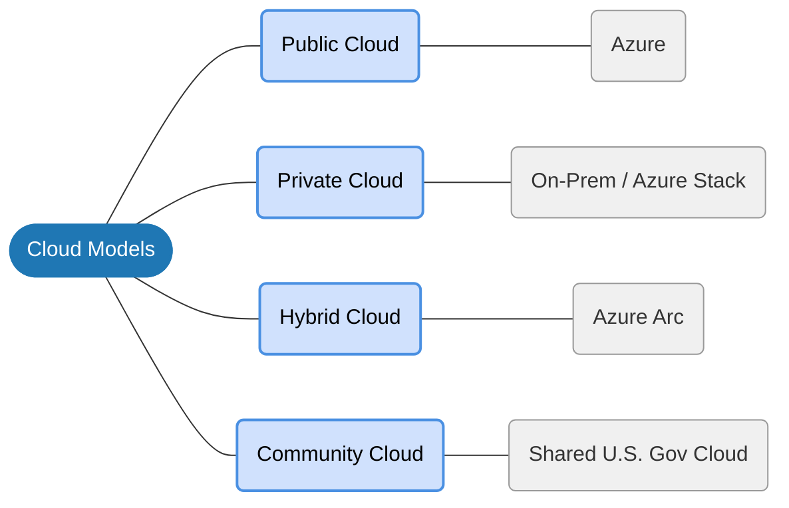

# Types of Cloud Models

### ► Public Cloud (Azure)		
Infrastructure is owned and operated by a third-party provider (e.g., Microsoft) and shared across organizations (multi-tenant). 
<ul style="list-style-type: none; padding-left: 20px;">
  <li>▫ <strong>Pros:</strong> Cost-effective, no maintenance, high elasticity.</li>
  <li>▫ <strong>Cons:</strong> Limited control, potential data security concerns.</li>
  <li>▫ <strong>Example:</strong> A web application using Azure App Service and Azure SQL Database that scales automatically to handle traffic spikes without purchasing hardware.</li>
</ul>
   
### ► Private Cloud (On-Prem/Azure Stack)
Cloud infrastructure used exclusively by a single organization, hosted on-premises or by a third party (single-tenant).
<ul style="list-style-type: none; padding-left: 20px;">
  <li>▫ <strong>Pros:</strong> Maximum security, customization, compliance.</li>
  <li>▫ <strong>Cons:</strong> High cost (CapEx), high management effort.</li>
  <li>▫ <strong>Example:</strong> A company using Azure Stack in their own data center to run legacy applications while maintaining, for regulatory reasons, strict control over the hardware.</li>
</ul>
  
### ► Hybrid Cloud (Azure Arc)
A combination of public and private clouds, allowing data and applications to be shared between them. 
<ul style="list-style-type: none; padding-left: 20px;">
  <li>▫ <strong>Pros:</strong> Flexibility, "bursting" capability to handle spikes, cost-optimization.</li>
  <li>▫ <strong>Cons:</strong> Complex to set up, security management for both environments.</li>
  <li>▫ <strong>Example:</strong> A retail company using an on-premises datacenter for sensitive transaction data (private), while using Azure Kubernetes Service (AKS) for their customer-facing website, using Azure Arc to manage both environments as one.</li>
</ul>
  
### ► Community Cloud
Infrastructure shared by several organizations with common concerns (e.g., compliance, security).
<ul style="list-style-type: none; padding-left: 20px;">
  <li>▫ <strong>Pros:</strong> Better security than public, cheaper than private, collaborative.</li>
  <li>▫ <strong>Cons:</strong> Limited customization, shared responsibility.</li>
  <li>▫ <strong>Example:</strong> A consortium of hospitals using a shared, compliant Azure environment for sharing medical imaging data.</li>
</ul>

## :::: Additional Concept ::::
### ► Multi Cloud:
Multicloud is the strategic use of services from two or more public cloud providers (e.g., Azure + AWS) to run applications, optimize performance, and avoid vendor lock-in.
<ul style="list-style-type: none; padding-left: 20px;">
  <li>▫ <strong>Pros:</strong> Flexibility to switch providers, minimizes downtime if one provider fails, leveraging the cheapest provider for specific tasks.</li>
  <li>▫ <strong>Cons:</strong> Requires specialized cross-platform expertise, harder to manage, monitor, and secure multiple platforms.</li>
  <li>▫ <strong>Example:</strong> A company uses Azure Cosmos DB for global, low-latency database needs, while simultaneously using AWS S3 for long-term data archiving. They might manage both using Azure Arc, which brings Azure’s security and governance to AWS resources.</li>
</ul>

***Key Azure Tool:*** Azure Arc is commonly used to manage servers, apps, and Kubernetes clusters across Azure, AWS, and on-premises, enabling a unified multicloud control plane.
