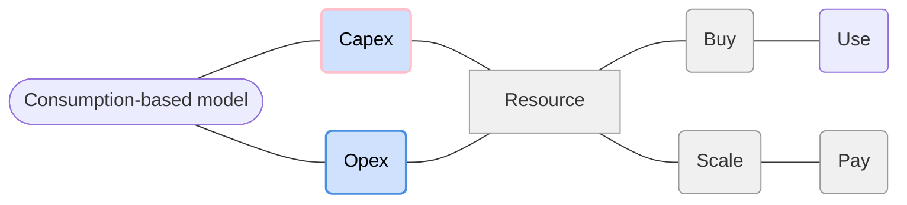

# Consumption-based model 

### Capex: 
Buy resource and then use. Paying for all the resources you are buying, whether you may use it or not.

### Opex:
Scaling resource as per need and paying for it based on usage like a bill.

## Cloud computing uses Opex.
This consumption-based model has many benefits, including:
<dl>
   <dd>▪ No upfront costs. </dd>
   <dd>▪ No need to purchase and manage costly infrastructure that users might not use to its fullest potential. </dd>
   <dd>▪ The ability to pay for more resources when they're needed. </dd>  
   <dd>▪ The ability to stop paying for resources that are no longer needed. </dd>
</dl>

