# Infrastructure as a Service (IaaS) in Azure

```mermaid
graph LR
    %% Styles and Themes
    classDef customer fill:#2c3e50,stroke:#1a252f,stroke-width:2px,color:#fff;
    classDef provider fill:#7f8c8d,stroke:#95a5a6,stroke-width:1px,color:#fff;
    classDef groupStyle fill:#f8f9fa,stroke:#bdc3c7,stroke-width:1px,stroke-dasharray: 5 5;

    %% --- MAP-STYLE INLINE LEGEND ---
    L1["🔵 Customer Managed (◼)"]:::customer --> IaaS
    L2["⚪ Provider Managed (☐)"]:::provider --> IaaS

    %% --- IAAS ONLY COLUMN (LANDSCAPE) ---
    subgraph IaaS [Infrastructure as a Service - IaaS]
        I1[Information and data ◼]:::customer
        I2[Devices mobiles & PCs ◼]:::customer
        I3[Accounts and Identities ◼]:::customer
        I4[Identity & directory infra ◼]:::customer
        I5[Applications ◼]:::customer
        I6[Network Controls ◼]:::customer
        I7[Operating System ◼]:::customer
        I8[Physical hosts ☐]:::provider
        I9[Physical network ☐]:::provider
        I10[Physical Datacenter ☐]:::provider
    end

    %% Apply group style
    style IaaS groupStyle

```

IaaS provides on-demand access to fundamental computing resources like virtual machines (VMs), storage, and networking, serving as a virtualized version of a traditional datacenter.

### How it Works: 
You rent infrastructure from Azure. You are responsible for managing the operating system, middleware, runtime, applications, and data.

### Azure Examples: 
Azure Virtual Machines (VMs), Azure Virtual Network, Azure Disk Storage.

### Pros:
<dl>
	<dd> ► <strong>Maximum Control:</strong> Full control over infrastructure, OS, and applications.</dd>
	<dd> ► <strong>Flexibility:</strong> Ideal for migrating legacy apps to the cloud without re-architecting.</dd>
	<dd> ► <strong>High Scalability:</strong> Easily scale resources up or down based on demand.</dd>
</dl>

### Cons:
<dl>
	<dd> ► <strong>High Management Overhead:</strong> You are responsible for patching, security, and maintenance.</dd>
	<dd> ► <strong>Complexity:</strong> Requires specialized IT expertise to manage.</dd>
</dl>

