# Software as Service (SaaS) 
SaaS delivers fully functional software applications over the internet on a subscription basis. 

```mermaid
graph LR
    %% Styles and Themes
    classDef customer fill:#2c3e50,stroke:#1a252f,stroke-width:2px,color:#fff;
    classDef shared fill:#e67e22,stroke:#d35400,stroke-width:2px,color:#fff;
    classDef provider fill:#7f8c8d,stroke:#95a5a6,stroke-width:1px,color:#fff;
    classDef groupStyle fill:#f8f9fa,stroke:#bdc3c7,stroke-width:1px,stroke-dasharray: 5 5;

    %% --- MAP-STYLE INLINE LEGEND ---
    L1["🔵 Customer Managed"]:::customer --> SaaS
    L2["🟠 Shared Responsibility"]:::shared --> SaaS
    L3["⚪ Provider Managed"]:::provider --> SaaS

    %% --- SAAS ONLY COLUMN (CONNECTED LANDSCAPE) ---
    subgraph SaaS [Software as a Service - SaaS]
        direction LR
        I1[Information and data]:::customer -->
        I2[Devices mobiles & PCs]:::customer -->
        I3[Accounts and Identities]:::customer -->
        I4[Identity & directory infra]:::shared -->
        I5[Applications]:::provider -->
        I6[Network Controls]:::provider -->
        I7[Operating System]:::provider -->
        I8[Physical hosts]:::provider -->
        I9[Physical network]:::provider -->
        I10[Physical Datacenter]:::provider
    end

    %% Apply group style
    style SaaS groupStyle


```

### How it Works: 
Microsoft handles everything—application, data, runtime, middleware, OS, and infrastructure. You simply access the software via a browser or app.

### Azure Examples: 
Microsoft Office 365, Dynamics 365, Azure DevOps.

### Pros:
<dl>
	<dd>► <strong>Zero Management:</strong> No installation, updates, or maintenance required.</dd>
	<dd>► <strong>Accessibility:</strong> Accessible from anywhere with an internet connection.</dd>
	<dd>► <strong>Predictable Cost:</strong> Usually subscription-based pricing. </dd>
</dl>

### Cons:
<dl>
	<dd>► <strong>Limited Flexibility:</strong> Little to no customization of the software functionality. </dd>
	<dd>► <strong>Data Security/Control:</strong> Rely entirely on the vendor for security and data integrity. </dd>
</dl>
