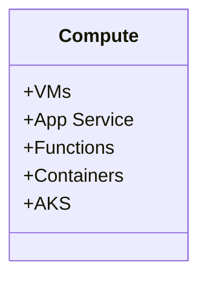
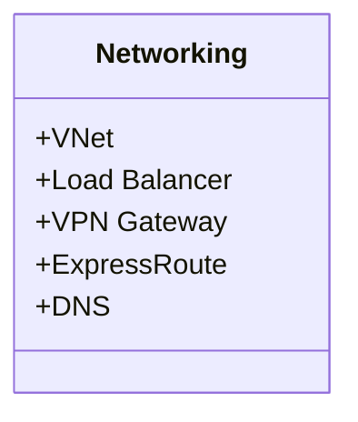
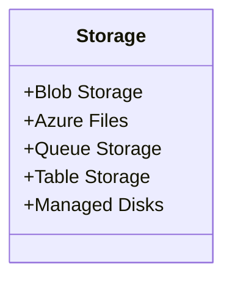
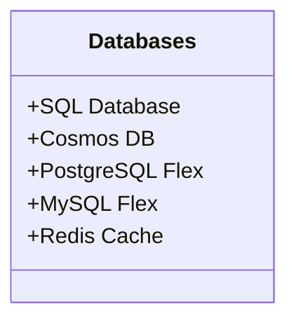
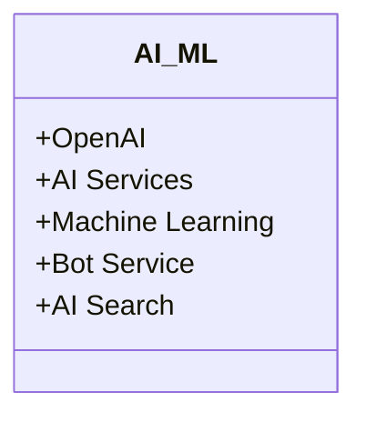
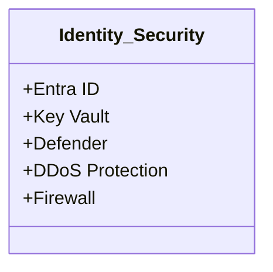
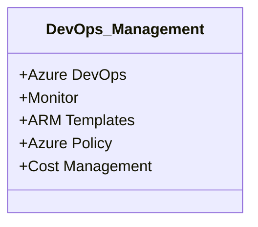
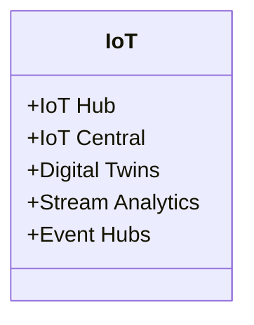
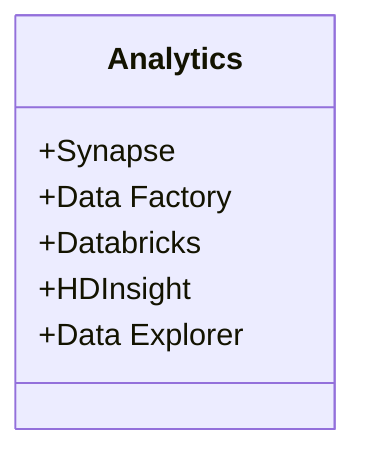
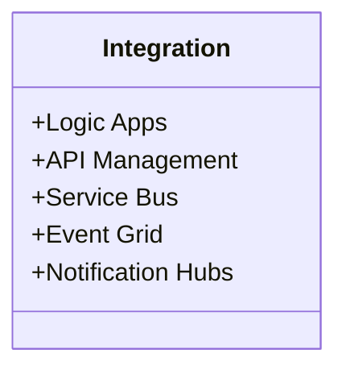

# Microsoft Azure Architecture and services
### Azure Offers:
Elevate operations with advanced, secure platform management tools that simplify your workflow.Gain the freedom to build, deploy, and manage applications globally using your preferred tools.

### What can be done with azure?
It is easy to handle and manage applications with dynamic requirements on azure due to the vast service it provides.

### Azure Compute & Networking

### Azure Compute & Networking

<table>
<tr>
<td>

</td>
<td>

</td>
</tr>
</table>

### Storage & Databases

<table>
<tr>
<td>

</td>
<td>

</td>
</tr>
</table>

### AI, ML & Security

<table>
<tr>
<td>

</td>
<td>

</td>
</tr>
</table>

### DevOps & IoT

<table>
<tr>
<td>

</td>
<td>

</td>
</tr>
</table>

### Analytics & Integration

<table>
<tr>
<td>

</td>
<td>

</td>
</tr>
</table>

</td>
</tr>
</table>

